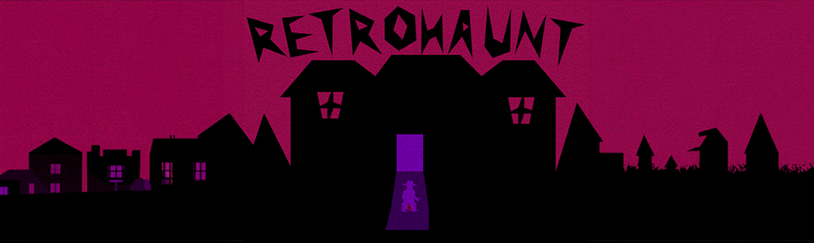

# Retrohaunt Extension

====

Someone or something is stealing our time. Today was yesterday and tomorrow is nowhere to be seen. Detective Clay is on the case!

1. Clone the repository
2. Run `npm install` to install node dependencies
3. Run `npm run build` to build the extension
4. Copy the `dist` folder into EXT
